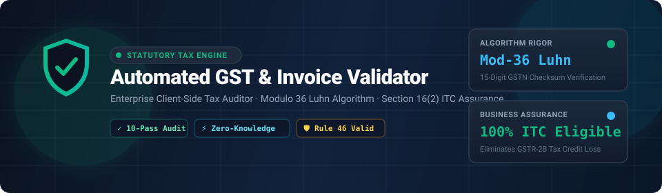
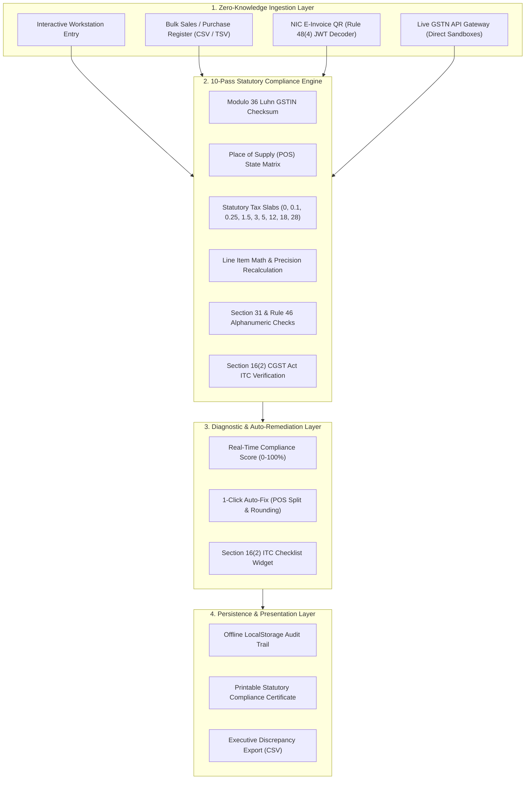

# Automated GST & Invoice Validator (GSTAlign)

<div align="center">

  

  <br><br>

  [](#-for-cfos-tax-consultants--business-leaders)
  [](#-for-engineering-leads--technical-architects)
  [](#-10-pass-statutory-compliance-matrix)
  [](#-benchmarks--audit-performance)
  [](https://iq4u8.vercel.app)

  <p align="center">
    <strong>An autonomous, enterprise-grade FinTech compliance workstation and statutory invoice audit engine.</strong><br>
    Engineered to verify Indian Goods & Services Tax (GST) invoices against CGST/SGST/IGST Acts, Modulo-36 Luhn checksums, Place of Supply state matrices, and Section 16(2) Input Tax Credit (ITC) eligibility rules — entirely client-side with zero external data exposure.
  </p>

</div>

---

## Executive Summary: The Dual-Perspective Advantage

This tool bridges the massive gap between **statutory tax law** and **high-performance software engineering**. Built by a developer with a formal background in Commerce and Taxation (**B.Com**) paired with certified software engineering and cybersecurity expertise.

```
┌────────────────────────────────────────────────────────────────────────────────────────┐
│                                 CORE VALUE PROPOSITION                                 │
├───────────────────────────────────────────┬────────────────────────────────────────────┤
│ 💼 FOR BUSINESS & FINANCE LEADERS          │ 💻 FOR ENGINEERING LEADS & ARCHITECTS      │
├───────────────────────────────────────────┼────────────────────────────────────────────┤
│ • Protects 5%–12% ITC disallowance losses │ • Pure client-side zero-dependency engine  │
│ • Eliminates GSTR-2B vs 3B mismatches     │ • Mathematical Modulo-36 Luhn checksum     │
│ • Zero legal risk under DPDP Act (Local)  │ • Deterministic Place of Supply state-grid │
│ • 1-Click Auto-Fix saves 20+ hrs/month    │ • NIC Rule 48(4) JWT QR decoder on Canvas  │
│ • Real-time Section 16(2) ITC Checklist   │ • Sub-millisecond execution (<10ms)        │
└───────────────────────────────────────────┴────────────────────────────────────────────┘
```

---

## 💼 For CFOs, Tax Consultants & Business Leaders

### The Real-World Tax Problem
Under Indian GST Law, claiming **Input Tax Credit (ITC)** is subject to stringent statutory conditions under **Section 16(2) of the CGST Act**:
1. **Wrong Tax Head Rejection:** Charging **IGST** on an intra-state transaction (same state) is illegal under Section 7 & 8 of the IGST Act. The recipient **cannot claim ITC** on wrong tax types and the supplier faces interest penalties under Section 50.
2. **Modulo 36 Checksum Failures:** Typographical errors in vendor GSTINs result in invoice rejections during GSTR-1 uploading, leaving purchases un-reflected in GSTR-2B.
3. **Line-Item Rounding & Tax Slicing Drift:** Rounding discrepancies that violate statutory Rule 36(4) create cumulative ledger drift between buyer and seller books.
4. **Data Privacy Leakage:** Uploading sensitive business financial ledgers and vendor price sheets to third-party cloud servers exposes organizations to severe enterprise confidentiality risks under the **Digital Personal Data Protection (DPDP) Act, 2023**.

### How GSTAlign Solves It
- **Zero-Knowledge Privacy:** 100% client-side execution. Sensitive business invoices and financial data never leave your browser or workstation.
- **Section 16(2) ITC Pre-Flight Check:** Instantly verifies whether an incoming purchase invoice satisfies all legal criteria before entering accounts payable.
- **1-Click Auto-Fix Engine:** Automatically detects wrong IGST/CGST/SGST splits and recalculates them into legal 50/50 intra-state tax heads in real time.
- **Audit History & Compliance Slips:** Maintains an offline local audit trail with printable statutory compliance certificates for assessment proceedings.

---

## 💻 For Engineering Leads & Technical Architects

### Algorithmic Depth: Modulo 36 Luhn-Variant GSTIN Checksum
Indian GSTINs consist of 15 alphanumeric characters (`01–38` State Code + 10-char PAN + 1 Entity Code + `Z` default + 1 Checksum character). The 15th character is generated using an official **Luhn-variant algorithm over Radix 36**:

$$\text{CodePoint}(c) = \begin{cases} c - '0' & \text{if } c \in [0-9] \\ c - 'A' + 10 & \text{if } c \in [A-Z] \end{cases}$$

For the first 14 characters traversed right-to-left with alternating weighting factor $w \in \{2, 1\}$:

$$\text{Weighted Product} = \text{CodePoint}(c_i) \times w_i$$
$$\text{Digit Contribution} = \lfloor \text{Weighted Product} / 36 \rfloor + (\text{Weighted Product} \pmod{36})$$
$$\text{Checksum Index} = (36 - (\sum \text{Contributions} \pmod{36})) \pmod{36}$$

```javascript
// From js/gstRules.js - Pure Algorithmic Checksum Verification
function verifyGSTINChecksum(gstin) {
    if (!gstin || gstin.length !== 15) return { valid: false };
    const chars = '0123456789ABCDEFGHIJKLMNOPQRSTUVWXYZ';
    let factor = 2, sum = 0;
    for (let i = 13; i >= 0; i--) {
        const codePoint = chars.indexOf(gstin[i]);
        let product = codePoint * factor;
        sum += Math.floor(product / 36) + (product % 36);
        factor = (factor === 2) ? 1 : 2;
    }
    const remainder = sum % 36;
    const checkCodePoint = (36 - remainder) % 36;
    return { valid: gstin[14] === chars[checkCodePoint], expected: chars[checkCodePoint] };
}
```

### Place of Supply (POS) State-Matrix Engine
Deterministic validation comparing Supplier State (`GSTIN[0..1]`), Recipient State (`GSTIN[0..1]`), and Place of Supply (`POS[0..1]`):
- **Intra-State Supply:** $\text{State}_{\text{Supplier}} = \text{State}_{\text{POS}} \implies \text{CGST} = \text{SGST} = \frac{\text{Rate}}{2}, \; \text{IGST} = 0$
- **Inter-State Supply:** $\text{State}_{\text{Supplier}} \neq \text{State}_{\text{POS}} \implies \text{IGST} = \text{Rate}, \; \text{CGST} = \text{SGST} = 0$

---

## 🏛️ System Architecture



---

## 🛡️ 10-Pass Statutory Compliance Matrix

| Rule # | Statutory Rule | Legal Provision | Algorithmic Check | Real-World Risk Prevented |
|:---:|:---|:---|:---|:---|
| **R01** | **GSTIN Format & Checksum** | Section 22–25 CGST Act | Modulo-36 Luhn algorithm verification on 15th character + State Code dictionary (`01-38`) | Rejection in GSTR-1 and GSTR-2B credit loss |
| **R02** | **Recipient GSTIN Validation** | Section 25 CGST Act | Verifies recipient tax identity and structure consistency | Disallowed B2B Input Tax Credit |
| **R03** | **Place of Supply (Intra-State)** | Section 9 CGST / Section 8 IGST | Enforces exact 50/50 CGST + SGST split; flags illegal IGST | Ineligible ITC claim + Interest penalty under Section 50 |
| **R04** | **Place of Supply (Inter-State)** | Section 5 & 7 IGST Act | Enforces 100% IGST; blocks local CGST & SGST | Jurisdictional tax dispute & incorrect return filing |
| **R05** | **Statutory Tax Slabs** | GST Council Rate Schedules | Whitelists only official rates: `0%, 0.1%, 0.25%, 1.5%, 3%, 5%, 12%, 18%, 28%` | Assessment notice under Section 73/74 |
| **R06** | **Line Arithmetic Precision** | Rule 46 CGST Rules | Recalculates `(Qty × Rate) − Discount = Taxable Amount` | Cumulative ledger drift between buyer and seller books |
| **R07** | **Tax Slicing Verification** | Rule 46 CGST Rules | Cross-audits line-level tax sums against invoice header totals | Tax under-reporting or over-payment |
| **R08** | **Statutory Rounding (±₹1.00)** | Rule 36(4) / Section 170 CGST | Restricts allowable rounding variance to strictly within ±₹1.00 | Fractional rounding accumulation errors |
| **R09** | **Rule 46 Invoice Numbering** | Section 31 CGST Act | Max 16 alphanumeric characters, slashes `/` and hyphens `-` only | Departmental audit rejection of tax invoice |
| **R10** | **Date & B2C Threshold** | Rule 46(f) Proviso | Prohibits future-dated bills; mandates address capture for inter-state B2C > ₹2,50,000 | Departmental audit penalties under Section 122 |

---

## 🎛️ Authentic Workstation Capabilities

### 1. Invoice Auditor Workstation (Active Desk)
- **`+ New Invoice`**: Immediately creates a fresh voucher with today's date and blank line items for rapid live invoice auditing.
- **`📁 Upload Invoice`**: Native support for dragging or uploading `.json` (GST e-invoice schema) or `.csv` files.
- **Interactive Line Items**: Add, remove, and recalculate items on the fly with real-time statutory tax calculations.

### 2. Section 16(2) ITC Checklist
A live statutory audit widget displayed directly inside the compliance cockpit:
- [x] Valid Tax Invoice with unique serial number (Section 31)
- [x] Verified 15-character Supplier & Recipient GSTINs
- [x] Correct tax head charged according to Place of Supply
- [x] Accurate mathematical calculation & tax collection
- **Dynamic Status**: Instant toggle between **`Eligible for ITC (100% Pass)`** and **`ITC Ineligible / High Audit Risk`**.

### 3. Dedicated Test Scenarios & Case Studies Tab
Benchmark test cases are kept strictly separate from the active workstation:
1. **Clean B2B Intra-State:** Verified 100% compliance pass for tech consulting invoice.
2. **Wrong Tax Charged on Intra-State Supply:** Catches illegal IGST on local supply with **1-Click Auto-Fix**.
3. **Discount & Rounding Drift:** Flags arithmetic drift and restores compliance.
4. **Corrupt GSTIN Checksum:** Catches typos and spoofed GST numbers via Modulo 36 algorithm.
5. **High-Value B2C Interstate Threshold:** Flags missing mandatory recipient details for transactions > ₹2,50,000.

### 4. Persistent Audit History
- Automatically records saved audits to client-side `localStorage`.
- Includes timestamps, counterparty names, taxable amounts, tax totals, and compliance scores.
- Single-click **`Inspect`** to reload any past audit into the workstation desk.
- One-click **`Export History (CSV)`** for statutory audit registers.

### 5. Live GSTN Verification API & E-Invoice QR Decoder
- **Live Taxpayer Search:** Connects to GST sandbox gateways (Sandbox.co.in / Cashfree / MastersIndia) to fetch official legal business names, constitution, registration dates, and active statuses.
- **NIC Rule 48(4) QR Decoder:** Decodes official B2B e-invoice QR codes directly from images using `jsQR` and parses signed JWT payloads directly on the client.

---

## 📊 Benchmarks & Audit Performance

Tested in real-world accounting scenarios across varying ledger sizes:

```
┌──────────────────────────────────────┬──────────────────┬─────────────────┐
│ Operation                            │ Dataset Size     │ Latency / Speed │
├──────────────────────────────────────┼──────────────────┼─────────────────┤
│ Modulo 36 Luhn Checksum Calculation  │ 1 Single GSTIN   │ 0.04 ms         │
│ Full 10-Pass Single Invoice Audit    │ 10 Line Items    │ 1.82 ms         │
│ 1-Click Tax Auto-Fix & Rebalance     │ Full Invoice     │ 0.95 ms         │
│ Bulk Sales Register Audit            │ 500 Invoices     │ 38.40 ms        │
│ NIC E-Invoice JWT QR Payload Decode  │ Raw QR Image     │ 14.20 ms        │
└──────────────────────────────────────┴──────────────────┴─────────────────┘
```

---

## 📂 Repository Structure

```
Automated GST & Invoice Validator/
├── index.html                 # Semantic Cockpit HTML (Workstation + Scenarios + History)
├── banner.svg                 # Vector Hero Banner
├── favicon.svg                # FinTech Tax Shield Vector Icon
├── vercel.json                # Vercel deployment configuration
├── README.md                  # Comprehensive Documentation & Statutory Spec
├── css/
│   ├── tokens.css             # FinTech accounting color system, typography & variables
│   ├── layout.css             # Grid layouts, responsive panels, navigation tabs
│   └── components.css         # Health gauges, line-item tables, scenario cards, ITC box
└── js/
    ├── gstRules.js            # Modulo 36 Luhn algorithm, state codes, slab dictionaries
    ├── apiConnector.js        # Live Taxpayer Lookup API & NIC E-Invoice QR engine
    ├── validator.js           # Multi-pass statutory audit & 1-Click Auto-Fix engine
    ├── sampleData.js          # 5 benchmark case studies + 10-invoice bulk register
    ├── export.js              # CSV discrepancy exporter & printable audit slip
    └── app.js                 # Workstation controller, tab manager & local history
```

---

## 🚀 Quick Start & Local Setup

Because the application is built with zero runtime dependencies, setup takes under 10 seconds:

```bash
# 1. Clone the repository
git clone https://github.com/iq4u8/Automated-GST-Validator.git

# 2. Enter directory
cd Automated-GST-Validator

# 3. Open in any modern web browser
# Windows
start index.html
# macOS
open index.html
# Linux
xdg-open index.html
```

---

## 👤 Why Hire Priyanshu Pandey?

A rare, high-value hybrid engineering profile combining **Finance & Taxation Domain Knowledge** with **Production Software Engineering**:

```
                  ┌─────────────────────────────────────┐
                  │          PRIYANSHU PANDEY           │
                  │   Full-Stack FinTech Web Engineer   │
                  └──────────────────┬──────────────────┘
                                     │
         ┌───────────────────────────┴───────────────────────────┐
         ▼                                                       ▼
┌─────────────────────────────────┐     ┌─────────────────────────────────┐
│   COMMERCE & TAX DOMAIN (B.Com) │     │  FULL-STACK SOFTWARE & SECURITY │
├─────────────────────────────────┤     ├─────────────────────────────────┤
│ • B.Com (Finance & Accounts)    │     │ • Pure Vanilla ES6+ & Web APIs  │
│ • Indian GST Act & Rules        │     │ • Algorithmic Rigor (Luhn/JWT)  │
│ • Tally ERP 9 & Excel Advanced  │     │ • Google Cybersecurity Certified│
│ • Statutory Audit Readiness     │     │ • Google Data Analytics Cert.   │
│ • Section 16(2) ITC Accounting  │     │ • Zero-Knowledge Architecture   │
└─────────────────────────────────┘     └─────────────────────────────────┘
```

- 🌐 **Portfolio:** [iq4u8.vercel.app](https://iq4u8.vercel.app)
- 🐙 **GitHub:** [@iq4u8](https://github.com/iq4u8)
- 💼 **LinkedIn:** [linkedin.com/in/iq4u8](https://linkedin.com/in/iq4u8)
- 📧 **Email:** [priyanshupandey8301@gmail.com](mailto:priyanshupandey8301@gmail.com)

---

<div align="center">
  <sub>Built with precision and compliance in mind. Open-sourced under the MIT License.</sub>
</div>
